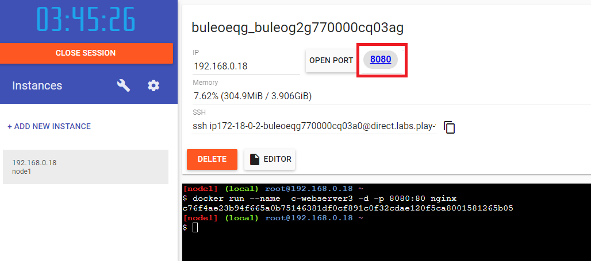

# Dockers 101

- [1. Setting up the test environment](#1-setting-up-the-test-environment)
   - [1. Installation options](#1-installation-options)
      - [Option 1 - Installing on Ubuntu](#option-1---installing-on-ubuntu)
      - [Option 2 - Use Play with Docker](#option-2---use-play-with-docker)
   - [2. Check docker information](#2-check-docker-information)
- [2. Working with images](#2-working-with-images)
- [3. Working with containers](#3-working-with-containers)
- [4. Networking introduction](#4-networking-introduction)
  - [1. Networking basics](#1-networking-basics)
  - [2. User defined networks](#2-user-defined-networks)
  - [3. Port exposing](#3-port-exposing)
- [5. Data persistance](#5-data-persistance)
  - [1. Non persistent data](#1-non-persistent-data)
  - [2. Persistent data](#2-persistent-data)
    - [Persisting data using Volumes](#persisting-data-using-volumes)
    - [Persisting data using Bind mounts](#persisting-data-using-bind-mounts)

## 1. Setting up the test environment

### 1. Installation options

You have to options: you can install docker in your machine or, if you just want to start learning Docker without installing it, you can use *Play with Docker* but you will not be able to test the port publishing feature.

#### Option 1 - Installing on Ubuntu

For further information refer to [Install Docker Engine on Ubuntu](https://docs.docker.com/engine/install/ubuntu/)

To install Docker on Ubuntu:

1. Login to your Ubuntu machine

1. Update the apt package index and install packages to allow apt to use a repository over HTTPS by executing:

   ```bash
   sudo apt-get -y update
   sudo apt-get -y install \
				apt-transport-https \
				ca-certificates \
				curl \
				gnupg-agent \
				software-properties-common
   ```

1. Add Docker official GPG key by executing:

   ```bash
   curl -fsSL https://download.docker.com/linux/ubuntu/gpg | sudo apt-key add -
   ```

1. Set up the stable repository by executing:

   ```bash
   sudo add-apt-repository "deb [arch=amd64] https://download.docker.com/linux/ubuntu $(lsb_release -cs) stable"
   ```

1. Install docker

   ```bash
   sudo apt-get -y update
   ```

   ```bash
   sudo apt-get install -y docker-ce docker-ce-cli containerd.io
   ```

1. Configure the service

   To configure Docker for automatic startup at server start execute:

   ```bash
   sudo systemctl enable docker 
   ```

   To check if Docker is enabled execute:

   ```bash
   sudo systemctl is-enabled docker
   ```

   To see Docker status execute:

   ```bash
   sudo service docker status
   ```

#### Option 2 - Use Play with Docker

You can use the [Play with Docker](https://labs.play-with-docker.com/)

Play with Docker is a Docker playground which allows users to run Docker commands in a matter of seconds. It gives the experience of having a free Alpine Linux Virtual Machine in browser, where you can build and run Docker containers and even create clusters in Docker Swarm Mode.

### 2. Check docker information

1. See Docker version information:

   ```bash
   docker version 
   ```

1. See system-wide information

   ```bash
   docker system info
   ```

---

## 2. Working with images

You can think of Docker images as being like VM templates. A VM template is like a stopped VM,  a Docker image is like a stopped container.

You start by pulling images from an image registry. 

The most popular registry is [Docker Hub](https://hub.docker.com), but others do exist.

The pull operation downloads the image to your local Docker host where you can use it to start one or more Docker containers.

Images are made up of multiple layers that get stacked on top of each other and represented as a single object.

Inside of the image is a cut-down operating system (OS) and all the files and dependencies required to run an application.

Because containers are intended to be fast and lightweight, images tend to be small.

1. Clean up the environment by executing:

   ``` bash
   docker container rm $(docker container ls -aq) -f
   ```

   ``` bash
   docker image rm $(docker image ls -aq) -f
   ```

1. List existing images

   ```bash
   docker image ls
   ```

1. Pull the image alpine:latest

   ```bash
   docker image pull alpine:latest
   ```

   > alpine is a minimal Docker image based on Alpine Linux with a complete package index and only 5 MB in size!

1. Pull the image nginx:latest

   ```bash
   docker image pull nginx:latest
   ```

   > Nginx (pronounced "engine-x") is an open source reverse proxy server for HTTP, HTTPS, SMTP, POP3, and IMAP protocols, as well as a load balancer, HTTP cache, and a web server (origin server).

1. Pull the image ubuntu:latest

   ```bash
   docker image pull ubuntu:latest
   ```

1. You can search the registry to look for images with specific words, for example:

   ```bash
   docker search microsoft
   ```

   ```bash
   docker search mysql
   ```

1. List images

   ```bash
   docker image ls
   ```

   You will see the three images you just pulled.

1. See the details of the nginx image

   ```bash
   docker image inspect nginx
   ```

1. Delete the **alpine** image

   ```bash
   docker image rm alpine
   ```

   > To refer to an image in the previous commands, you can also use the image id

1. List images

   ```bash
   docker image ls
   ```

   Notice that the image **alpine** is no longer available.

---

## 3. Working with containers

1. Clean up the environment by executing:

   ```bash
   docker container rm $(docker container ls -aq) -f
   ```

1. Start a container in interactive mode

   You can start a container interactive mode or detached mode.

   Run a container in interactive mode (by using the **-i** option) based on the ubuntu:latest image

   ```bash
   docker container run -it ubuntu:latest /bin/bash    
   ```

   The container will start and you will get connected to a bash session inside the container (notice that the name of the host changed in the prompt after running *docker container run -it*). You can execute commands inside the container, for example, list running processes:

   ```bash
   ps -ef
   ```

   Notice that only one single process is running inside the container. However, you can see different things in different images.

   To leave the container, execute

   ```bash
   exit
   ```

1. List containers

   ```bash
   docker container ls
   ```

   Notice that the container is not running anymore. At the moment you exited the container, the only running process ended, so the container

   Run a container in interactive mode (by using the **-i** option) based on the ubuntu image:

   ```bash
   docker container run -it ubuntu:latest /bin/bash    
   ```

   Detach from the container and leave it running by pressing **Ctrl + PQ**

   List containers:
   
   ```bash
   docker container ls
   ```

   The container is still running

1. Run a container in detached mode

   Run a container in detached mode (by using the **-d** option) based on the ubuntu image

   ```bash
   docker container run -t -d ubuntu:latest
   ```

	List containers
   
   ```bash
   docker container ls
   ```

   You have now two containers running. The one you created in interactive mode (but detached from it later) and the one you created in detached mode.

   Notice the container names. They are assigned automatically by Docker as you did not name the containers  explicitly

   Attach to any of the containers by executing:

   ```bash
   docker container exec -it <container id | name> bash
   ```

   Exit the container

   ```bash
   exit
   ```

1. Create a container with an specific name

   Create a container and explicitly set a name for it:
    
   ```bash
   docker container run -t -d --name ubuntu1 ubuntu:latest
   ```

   List containers

   ```bash
   docker container ls
   ```

   A container named **ubuntu1** was created.

1. Stop a container

   You can stop containers if needed

   ```bash
   docker container stop ubuntu1
   ```

   List containers

   ```bash
   docker container ls
   ```

   Notice that **ubuntu1** is not listed. To list all containers, even those that are not running, execute:
   ```bash
   docker container ls -a
   ```

   Notice that **ubuntu1** is in status **Exited**

1. Start a container

   You can start containers if needed

   ```bash
   docker container start ubuntu1
   ```

   List all containers, notice that **ubuntu1** is now **Up**

   ```bash
   docker container ls -a
   ```

1. Delete a container

   Delete the container **ubuntu1**
   
   ```bash
   docker container rm ubuntu1
   ```

   You cannot!!! You cannot delete running containers, so you must stop it first

   ```bash
   docker container stop ubuntu1
   ```

   and then it can be deleted
   ```bash
   docker container rm ubuntu1
   ```

   List containers and notice that **ubuntu1** was actually deleted
   
   ```bash
   docker container ls -a
   ```

---

## 4. Networking introduction

### 1. Networking basics

Docker's networking subsystem is pluggable, using drivers. Several drivers exist by default, and provide core networking functionality. All containers are attached to a Docker network (but you can completely disable the networking stack on a container). 

**bridge** is the default network driver in Linux

Every Docker host gets a default single-host bridge network:
- **bridge** on Linux
- **nat** on Windows

1. Clean up the environment by deleting all existing containers 

   ```bash
   docker container rm $(docker container ls -aq) -f
   docker network rm demonet
   ```

1. Explore networks

	List existing networks
    
	```bash
    docker network ls
   ```

   Inspect the default bridge network
   
   ```bash
   docker network inspect bridge
   ```

   Notice the value for **Config:Subnet**. The containers will have IPs inside that subnet

1. Run a container and explore networking

   Run a container

   ```bash
   docker run --name  c-webserver1 -d nginx
   ```

   Connect to the container

   ```bash
   docker container exec -it c-webserver1 bash
   ```

   Inside the container explore the hostname

   ```bash
   hostname
   ```

   Inside the container, see the IP address asigned 
    
   ```bash
   more /etc/hosts
   ```

   Notice that it is using an IP address from 172.17.0.0/16 (the Docker network subnet), such as *172.17.0.2*

   Exit the container

   ```bash
   exit
   ```

   Inspect the default bridge network again

   ```bash
   docker network inspect bridge
   ```

   Notice that the container **c-webserver1** is listed in **Containers** and you can also see the IP assigned there.

---

### 2. User defined networks

You can create user-defined networks. Using user-defined networks instead of the default networks have some advantages:
- Containers on the default bridge network can only access each other by IP addresses, containers on a user-defined network can access each others by name using the internal docker DNS service.
- Containers can be attached and detached from user-defined networks on the fly.

1. Create a new bridge network named **demonet** and specify the subnet for it

   ```bash
   docker network create -d bridge --subnet=192.168.1.0/25 demonet
   ```

   Inspect the new network 
   ```bash
   docker network inspect demonet
   ```

1. Review connectivity between containers

   Create two new containers attached to the new network

   ```bash
   docker run --name  c-webserver2 -d --hostname c-webserver2 --network demonet nginx
   ```

   ```bash
   docker container run -t -d --name ubuntu1 --network demonet ubuntu:latest 
   ```

   Inspect the network you created 

   ```bash
   docker network inspect demonet
   ```

   Notice both containers are attached to the network

   Connect to the **ubuntu1** container 

   ```bash
   docker container exec -it ubuntu1 bash
   ```

   Inside the container, connect to the web service on **c-webserver2** by name (not using the IP address). You first need to install a text web browser for demo purposes named **lynx**

   ```bash 
   apt-get update; apt-get install -y lynx 
   ```

   Open the text web browser and connect to c-webserver2 on port 80

   ```bash
   lynx c-webserver2:80
   ```

   Notice that you used the container name but no DNS server has been configured. Name resolution was provided by the docker DNS service for the user-defined network

   Exit the container

   ```bash
   exit
   ```

   You have accessed the web service on **c-webserver2** byname from **ubuntu1**

---

### 3. Port exposing

If you want the service to be accessible from outside the host, publish the port inside the container to a port in the host.

1. Inspect the **nginx** image. You will see that it exposes the port 80. You can connect to the web service listening on port 80 from another container within the same docker network.

   ```bash
   docker image inspect nginx
   ```

1. Publish the port 80 inside the container to the port 8080 on the host

   ```bash
   docker run --name  c-webserver3 -d -p 8080:80 nginx
   ```

   Open a web brower and connect to your Docker host on port 8080. If you are using **Play with Docker**, you can connect to the container on port 8080 by clicking on the link **8080** shown in the following image:

   


## 5. Data persistance

### 1. Non persistent data

Any modification to a container is persisted until the container is deleted. Modifications are not lost when the container is stopped.

1. Clean up the environment by executing:

   ```bash
   docker container rm $(docker container ls -aq) -f
   ```

1. Create a file inside a container

   Run a container in interactive mode

   ```bash
   docker container run --name ubuntu1 -it ubuntu:latest /bin/bash
   ```
 
   Inside the container, create a new file and make sure it was created

   ```bash
   touch testfile.txt
   ls
   ```

   Exit the container 
   ```bash
   exit
   ```

1. Confirm the container is stopped

   List all the containers

   ```bash
   docker container ls -a
   ```

   The container is now stopped as expected.

   Start the container:

   ```bash
   docker container start ubuntu1
   ```

1. Confirm the file is still in the container even after a restart

	Connect to the container 
  
   ```bash
   docker container exec -it ubuntu1 bash
   ```

   Inside the container, list files

   ```bash
   ls
   ```

   Notice the file **testfile.txt** is still there even when the container was stopped and restarted.

   Exit the container 

   ```bash
   exit
   ```

1. Delete the container

   ```bash   
   docker container stop ubuntu1
   docker container rm ubuntu1
   ```

   Now all changes made inside the container were lost!!!!!!!

### 2. Persistent data
Docker has two options for containers to store files in the host machine, so that the files are persisted even after the container stops:
- volumes
- bind mounts.

If you are running Docker on Linux you can also use a tmpfs mount. If you're running Docker on Windows you can also use a named pipe.

Volumes are the preferred mechanism for persisting data generated by and used by Docker containers. While bind mounts are dependent on the directory structure of the host machine, volumes are completely managed by Docker. Volumes have several advantages over bind mounts, for further information refer to [Manage data in Docker](https://docs.docker.com/storage/)

#### Persisting data using Volumes

The recommended way to persist data in containers is with volumes.

1. Clean up your environment. Delete all existing containers by executing:

   ```bash
   docker container rm $(docker container ls -aq) -f 
   ```

1. To create a volume execute: 

   ```bash
   docker volume create myvol1
   ```

1. Create a second volume by executing:

   ```bash
   docker volume create myvol2
   ```

1. To list all volumes, execute:

   ```bash
   docker volume ls
   ```

1. To see where the volume was created, execute

   ```bash
   docker volume inspect myvol1
   ```

	Notice:
	- the **driver** type: *local*. It will only allow to access the volume from the local host, but other drivers exist
	- the **Mountpoint** setting. It tells where the volume is located

1. To delete a volume

   ```bash
   docker volume rm myvol2
   ```

1. In the mount point for the **myvol1**, create a file named **index.html** with the following content:

   ```html
   <!DOCTYPE html>
   <html>
   <head>
   <title>Welcome to nginx!</title>
   <style>
      body {
        width: 35em;
        margin: 0 auto;
        font-family: Tahoma, Verdana, Arial, sans-serif;
      }
   </style>
   </head>
   <body>
   <h1>Welcome to nginx!</h1>
   <p>This page content comes from the docker volume </p>
   <p><em>Thank you for using completing this exercise.</em></p>
   </body>
   </html>
   ```

1. Create a container from the nginx image, and mount the volume **myvol1** to the **/usr/share/nginx/html** directory  within the container, so the web server gets the content to show from the volume

   ```bash
   docker run -d --name c-webserver2 -p 8080:80 --mount source=myvol1,target=/usr/share/nginx/html nginx
   ```

	**IMPORTANT:**If you start a container with a volume that does not yet exist, Docker creates the volume for you.

	Open a web browser and go to your Docker host on port 8080

	On the Docker host, replace the content of the **index.html** file in  the mount point for the **myvol1**, with the following content

   ```html
   <!DOCTYPE html>
   <html>
   <head>
   <title>Welcome to nginx!</title>
   <style>
       body {
        width: 35em;
        margin: 0 auto;
        font-family: Tahoma, Verdana, Arial, sans-serif;
       }
   </style>
   </head>
   <body>
   <h1>Welcome to nginx!</h1>
   <p>This page content comes from the docker volume </p> 
   <p>The content has been chenged from outside the container, directly in the volume </p>
   <p><em>Thank you for using completing this exercise.</em></p>
   </body>
   </html>
   ```

   Refresh your browser. The change is visible within the container

   Connect to the container

   ```bash
   docker container exec -it c-webserver2 bash
   ```

	Inside the container, create a new file and make sure it was created

   ```bash
   cd /usr/share/nginx/html
   touch testfile.txt 
   ls
   ```

   Exit the container 
   ```bash
   exit
   ```

   Review the mount point for the volume in the docker host, the file you created within the container is there

   ```bash
   ls /var/lib/docker/volumes/myvol1/_data
   ```

#### Persisting data using Bind mounts

Bind mounts have been around since the early days of Docker. Bind mounts have limited functionality compared to volumes. When you use a bind mount, a file or directory on the host machine is mounted into a container. The file or directory is referenced by its full or relative path on the host machine. By contrast, when you use a volume, a new directory is created within Docker's storage directory on the host machine, and Docker manages that directory's contents.

The file or directory does not need to exist on the Docker host already. It is created on demand if it does not yet exist. Bind mounts are very performant, but they rely on the host machine's filesystem having a specific directory structure available. If you are developing new Docker applications, consider using named volumes instead.

1. Clean up your environment. Delete all existing containers by executing:

   ```bash
   docker container rm $(docker container ls -aq) -f
   ```

1. Create the directory **/dockerdata/html**

   ```bash
   mkdir -p /dockerdata/html
   ```

1. Create a file named **index.html** in the **/dockerdata/html** directory with the following content:

   ```plaintext
   <!DOCTYPE html>
   <html>
   <head>
   <title>Welcome to nginx!</title>
   <style>
       body {
        width: 35em;
        margin: 0 auto;
        font-family: Tahoma, Verdana, Arial, sans-serif;
       }
   </style>
   </head>
   <body>
   <h1>Welcome to nginx!</h1>
   <p>This page content comes from directory mounted using Bind mounts </p>
   <p><em>Thank you for using completing this exercise.</em></p>
   </body>
   </html>
   ```

1. Create a container from the nginx image, and mount the local directory **/dockerdata/html** to the **/usr/share/nginx/html** directory within the container, so the web server gets the content to show from the volume

   ```bash
   docker run -d --name c-webserver3 -p 8080:80  --mount type=bind,source=/dockerdata/html,target=/usr/share/nginx/html nginx
   ```

   Open a web browser and go to your Docker host on port 8080